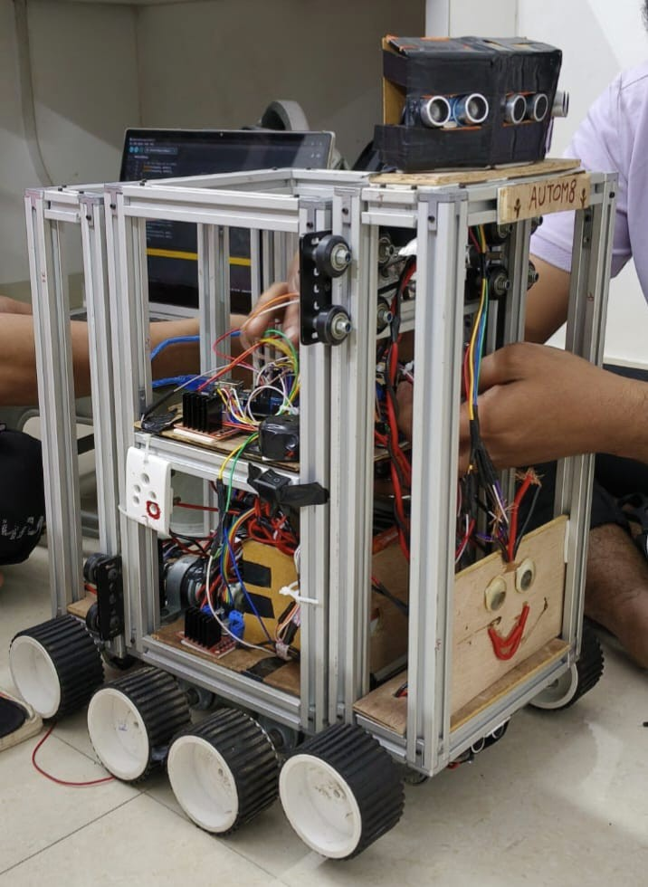
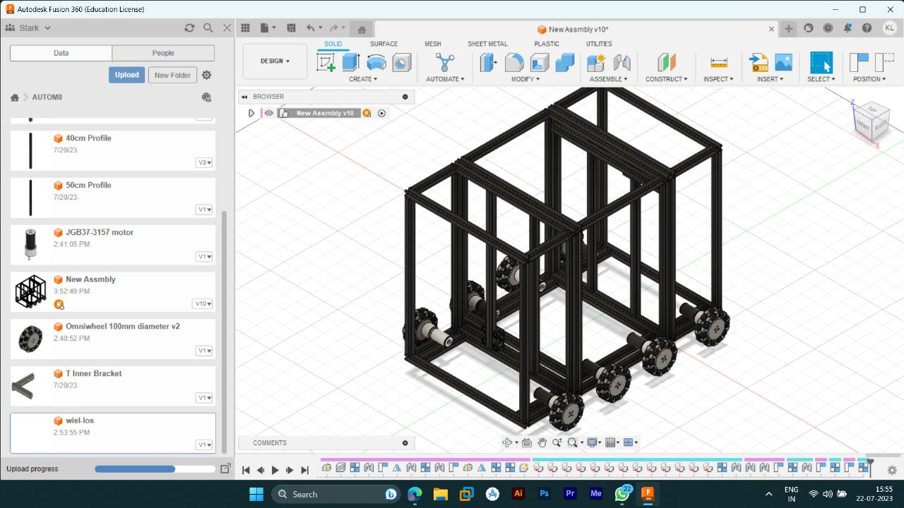
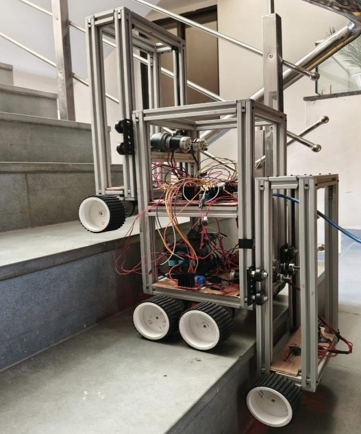
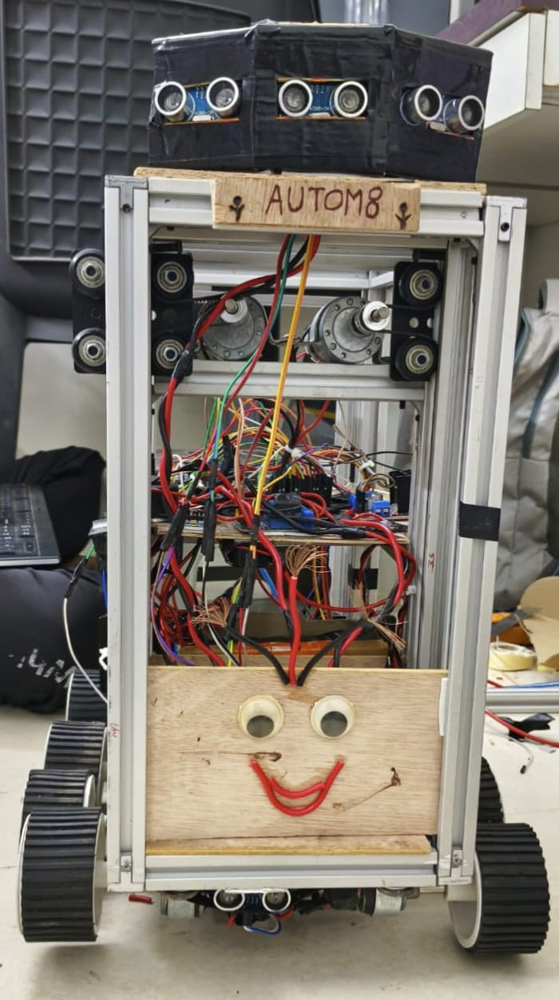
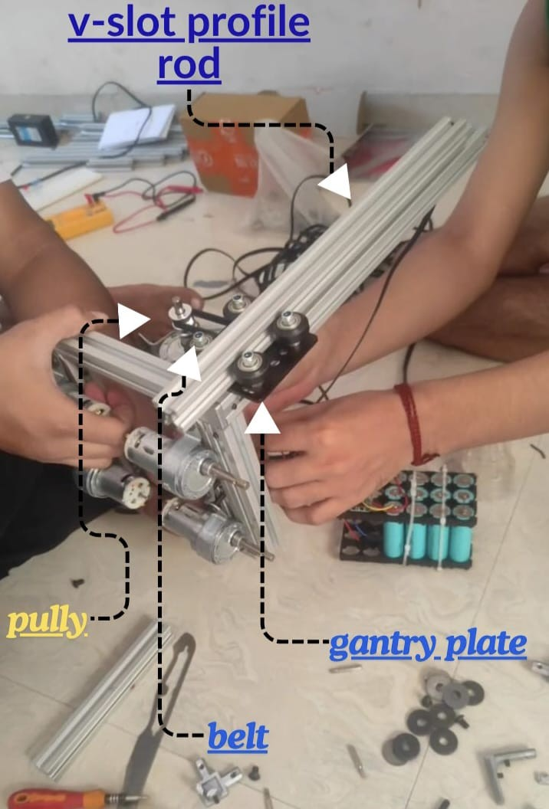

# AUTOM8 — Tri-Modular Campus Delivery Robot with Stair-Traversal Capability

**Final Year B.Tech Project | Robotics and Automation Engineering | Parul University, Vadodara | 2023–2024**

**Project Grade: O (Outstanding)**

**Full Project Report:** [View Report (142 pages)](AUTOM8_Project_Report.pdf)

---

## Overview

AUTOM8 is a stair-climbing campus delivery robot designed, fabricated, and tested as a final year B.Tech project. The robot addresses a practical gap in Indian institutional environments — no low-cost, stair-capable delivery robot currently exists for multi-floor campus deployment.

The total prototype cost is approximately ₹33,000 (€370), funded entirely by the student team. AUTOM8 is presented as a proof-of-concept prototype demonstrating the mechanical and control feasibility of the proposed approach.

---


---

## The Problem

Multi-floor delivery in Indian academic institutions relies entirely on manual effort. Commercially available ground-level robots cannot navigate staircases. Stair-capable research platforms cost tens of thousands of dollars — far beyond institutional procurement budgets.

AUTOM8 demonstrates that a mechanically sound, stair-capable delivery robot can be built at a cost that makes it genuinely deployable in Indian institutional environments.

---

## CAD Model — Fusion 360




---


## Key Technical Contributions

- **Sequential gantry lift mechanism** — three-body segmented chassis climbs staircases by lifting each box section onto successive stair treads in sequence
- **Constraint-reaction lifting principle** — middle box rises between two anchored outer boxes using GT2 belt drive and V-slot linear rails, requiring no external support structure
- **Dual stair-trigger system** — timing-based control for fixed campus geometry and HC-SR04 ultrasonic triggering for variable stair environments
- **NBC IS 1644 compliance** — compatible stair geometry: tread 280–400mm, riser 150–220mm, covering the full Indian educational building standard
- **Reactive obstacle detection and halt** — three front-facing HC-SR04 sensors with auto-resume and buzzer alert
- **Encoder-based navigation with MPU-6050 yaw correction** — pre-programmed fixed-route delivery with real-time heading correction on flat terrain

---

## Robot Specifications

| Parameter | Value |
|---|---|
| Architecture | Three-body segmented chassis (front, middle, back box) |
| Total weight (unloaded) | ~12.1 kg |
| Frame material | 20×20mm aluminium T-slot and V-slot extrusion |
| Gantry motors | 4× 100 RPM Johnson DC (SKU 5726, Robu.in) |
| Wheel motors | 8× 200 RPM Johnson DC (SKU 5727, Robu.in) |
| Motor drivers | 6× L298N dual H-bridge modules |
| Microcontroller | Arduino Mega 2560 (ATmega2560) |
| Battery | Custom 3S4P Li-Ion — 11.1V nominal, 8800mAh |
| BMS | 3S 25A with overcharge, over-discharge, short-circuit protection |
| Compatible tread depth | 280–400mm |
| Compatible riser height | 150–220mm |
| Payload capacity | Under 7 kg (belt-limited, calculated) |
| Flat terrain speed | 0.414 m/s at 70% PWM (1.49 km/hr) |
| Step climbing time | ~18–19s per step at 75–80% PWM (185mm riser) |
| Prototype cost | ₹33,000 (~€370) |

---

## System Architecture

```
┌─────────────────────────────────────────────────┐
│                  Arduino Mega 2560              │
│                                                 │
│  ┌──────────┐  ┌──────────┐  ┌──────────────┐   │
│  │ MPU-6050 │  │ Encoder  │  │  6× HC-SR04  │   │
│  │ IMU/Yaw  │  │ Distance │  │  (3+3 role)  │   │
│  └──────────┘  └──────────┘  └──────────────┘   │
│                                                 │
│  ┌────────────────────────────────────────────┐ │
│  │         6× L298N Motor Drivers             │ │
│  │  D1:Front  D2:Back  D3-D4:Mid  D5-D6:Gant  │ │
│  └────────────────────────────────────────────┘ │
└─────────────────────────────────────────────────┘
         │
         ▼
┌─────────────────────┐   ┌──────────────────────┐
│  8× Wheel Motors    │   │  4× Gantry Motors    │
│  200 RPM Johnson DC │   │  100 RPM Johnson DC  │
│  Flat terrain drive │   │  Sequential lift     │
└─────────────────────┘   └──────────────────────┘
```

---

## Six-Phase Stair Climbing Sequence

| Phase | Action | Motors Active |
|---|---|---|
| Phase 1 | Front box lifted above riser | Front gantry pair (Driver 5) |
| Phase 2 | Robot advances, front box lands on upper tread | All wheel motors |
| Phase 3 | Middle box lifted via constraint-reaction | All 4 gantry motors (Drivers 5+6) |
| Phase 4 | Robot advances, middle box lands on upper tread | All wheel motors |
| Phase 5 | Back box lifted above riser | Rear gantry pair (Driver 6) |
| Phase 6 | Robot advances, back box lands — step complete | All wheel motors |

The sequence repeats for each subsequent step. MPU-6050 and encoder are disabled during stair climbing and re-enabled when all three boxes reach the upper tread.

---


---


## Design Calculations Summary

All six design calculations are documented in full in the project report (Appendix A).

| Calculation | Key Result |
|---|---|
| 1 — Gantry Motor Torque | Minimum safety factor ≥7.5× (Phase 3, 9V, empty robot) |
| 2 — Wheel Motor Traction | Minimum traction SF = 14.7× (4 motors, 9V, 5kg payload) |
| 3 — Battery Runtime | ~52 min combined runtime at mid-load (80% capacity) |
| 4 — Payload Capacity | Belt-limited to 7.47 kg (governing: Phase 1 and 5, 2 motors each) |
| 5 — Stair Geometry | NBC 300mm tread / 150mm riser fully within AUTOM8 range ✓ |
| 6 — Speed and Timing | 0.414 m/s at 70% PWM; ~18s per step at 75% PWM, 185mm riser |

---

## Sensor Architecture

| Sensor | Quantity | Role | Placement |
|---|---|---|---|
| HC-SR04 | 3 | Stair detection (3cm trigger threshold) | Bottom-front of each box |
| HC-SR04 | 3 | Obstacle detection and halt (25cm threshold) | Top-front of front box |
| MPU-6050 | 1 | Yaw correction during flat terrain navigation | Middle box |
| Magnetic Hall encoder | 1 | Distance estimation for pre-programmed path | Front-left wheel motor shaft |
| Active piezo buzzer | 1 | Obstacle alert | Middle box |

---


---

## Stair Climbing Control — Three Stages

The stair climbing control logic was developed through three successive stages, each addressing the failure modes of the previous:

**Stage 1 — Timing-based control**
Fixed time delays for each phase. Successfully demonstrated the mechanical viability of the sequential gantry lift. Selected as the final deployment method for the fixed campus staircase due to consistent stair dimensions and sensor vibration issues in testing.

**Stage 2 — IR sensor triggering**
LM393-based IR sensors at 5cm trigger distance. Abandoned due to inconsistent performance under variable ambient lighting and sensitivity to stair surface colour and reflectivity.

**Stage 3 — HC-SR04 ultrasonic triggering**
Successfully validated. Immune to ambient lighting and surface colour. Occasional sensor mount displacement due to motor vibration noted. Available for deployment on staircases with variable or unknown dimensions.

---


---

## Known Limitations

22 limitations are fully documented in Appendix B of the project report. Key limitations:

- Open-loop motor control — no closed-loop speed feedback
- Single encoder — ~10% distance error accumulated over longer routes
- No stair descending capability in current prototype
- Payload capacity validated through calculation only — not tested on stairs
- GT2 belt elongation under cyclic loading requires periodic re-tensioning
- MPU-6050 disabled during stair climbing (intentional tilt cannot be distinguished from error)
- No payload compartment in current prototype
- Subsystems validated independently — full integrated end-to-end test identified as next step

---

## Component Cost Breakdown

| Category | Cost |
|---|---|
| Aluminium extrusion frame + hardware | ₹12,121 |
| Drive and gantry motors (12 total) | ₹6,564 |
| V-slot gantry plate sets (4×) | ₹3,596 |
| Battery cells + BMS | ₹1,986 |
| Motor driver modules (10 purchased) | ₹1,300 |
| Arduino Mega 2560 | ₹1,500 |
| Miscellaneous (wiring, fasteners, delivery) | ₹2,500 |
| Other components | ₹3,969 |
| **Grand Total (complete prototype)** | **₹33,536** |
| **Final robot only (excl. testing components)** | **₹32,952** |

---

## Proposed Future Work (Priority)

| Improvement | Priority |
|---|---|
| Rack-and-pinion or steel cable gantry drive (replace GT2 belt) | High |
| Payload compartment with locking mechanism | High |
| Closed-loop gantry position control (limit switches) | High |
| Autonomous docking charging station | High |
| MPU-6050 yaw-only active during stair climbing | Medium |
| Dual encoder with slip detection | Medium |
| Upgraded motor drivers (BTS7960) | Medium |

---

## Video Documentation

**Stair climbing — timing-based control:** [Watch on YouTube](https://youtu.be/JYtEZw-AAes)

**Stair climbing — HC-SR04 ultrasonic triggered:** [Watch on YouTube](https://youtu.be/veAblGGdoEw)

**Constraint-reaction middle box lift:** [Watch on YouTube](https://youtu.be/paRk35sNHkk)

**MPU-6050 heading correction test:** [Watch on YouTube](https://youtu.be/yI_KrRou6Mc)

---


## Team

| Name | Enrollment No. |
|---|---|
| Ketul Luhar | 210305123705 |
| Vatsalkumar Chauhan | 200305123901 |
| Prathamesh Mhaske | 210305123701 |
| Aniket Sharma | 200305123025 |

**Guided by:** Prof. Dr. Prince Jain | Prof. Jagdish Pampania

**Head of Department:** Prof. Dr. Heli Shah

---


*B.Tech Robotics and Automation Engineering | Parul University, Vadodara | 2023–2024*
